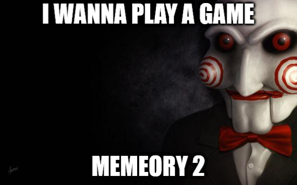

# 11 - Memeory 2.0
*We improved Memeory 1.0 and added an insane serverside component.
So, no more CSS-tricks. Muahahaha.*

*Flagbounty for everyone who can solve 10 successive rounds. Time per round is 30 seconds
 and only 3 missclicks are allowed.*

*Good game.*

[Memeory2](http://whale.hacking-lab.com:1111/)

---

This is gonna be fun!

The key here is to find out how it works. How does the server tells the client how to
distribute the cards? If you are careful, you notice that a picture returned to request
`http://whale.hacking-lab.com:1111/pic/{ID}` is different for each play! And 
you know that for example picture 1 will always be in the left bottom corner,
 picture 2 on its left and so on..
 
My solution is: 
1. Get session ID
2. Download all 98 cards - now you now the cards distribution
3. Group by file size (you will get 49 pairs)
4. Send the moves one by one to the server
5. Repeat 10 times (from step 2)
 
This is the final message:

`200 ok, here is your flag: 1-m3m3-4-d4y-k33p5-7h3-d0c70r-4w4y`

Check out the full solution [Memeory.kt](Memeory.kt).
