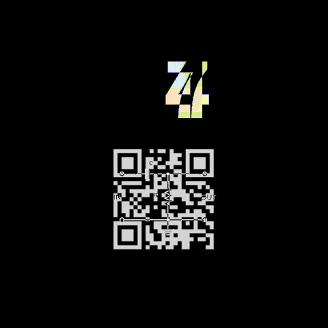

# 17 - New Egg Design

*Thumper is looking for a new design for his eggs. He tried several **filters** with his graphics program,
but unfortunately the QR codes got unreadable. Can you help him?!*


*No Easter egg here. Enter the flag directly on the flag page.*

---

## Blind alleys
This one gave me a hard time. I started with finding out what's on the picture. With a little help
from Google I learnt it is [High-pass filter](https://en.wikipedia.org/wiki/High-pass_filter), i.e.
a filter which passes signals with high frequencies and blocks signals low frequencies.

I misunderstood the hint (as I believe many others did)) and started to manipulate the picture in
Gimp. It was a dead end.

I analyzed the picture to get some clues. At first I used *Stegsolve* and combine it (XOR) with an the egg
picture from challenge 14. Except the centers and numbers they were identical.



Ok, it looks nothing is hidden in the egg.

Then I used this awesome tool [Forensically](https://29a.ch/photo-forensics) to check if something
is not hidden in the center of the picture. Again, I found nothing interesting.

I was getting convinces there's nothing hidden in the picture itself.

## Going deeper

After reading through [PNG specification](https://www.w3.org/TR/2003/REC-PNG-20031110/) I discovered
there is a concept of *filtering* in the PNG format itself!
See [PNG filtering](https://en.wikipedia.org/wiki/Portable_Network_Graphics#Filtering) on Wiki.

After spending a lot of time trying to decompress the PNG image with some of the existing tools,
I decided to decompress it myself and check how it's filtered. The solution was obvious right away,
the secret message is binary encoded in a sequence of filter types (one filter type per image row).
The secret message is
```
Congratulation, here is your flag: he19-TKii-2aVa-cKJo-9QCj
```

You can check the full solution in [EggDesign.kt](PngExtractor.kt).
