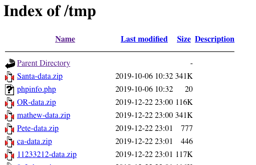

# HV19.23 Internet Data Archive

_Today's flag is available in the Internet Data Archive (IDA)._

http://whale.hacking-lab.com:23023/

---


The page offers download of older challenges. I tried to download ` The Braille Ball (Teaser 2018)`:


We got an OTP and a download link (`http://whale.hacking-lab.com:23023/tmp/vernjan-data.zip`).
I downloaded the archive, extracted it (archive is password protected) and compared the image with the one from the last year.
Images are identical (did `md5sum`). Nothing here most likely.

The next thing I tried was to download `The flag [classified, available as of 2020]`. The checkbox is disabled but
hey .. Using [Burp Suite](https://portswigger.net/burp) I captured the original request and changed its body to:
`username=vernjan&req%5B%5D=flag`. Didn't work. Server responded with: `Illegal Request`.


The next thing I focused on was the download link: `http://whale.hacking-lab.com:23023/tmp/vernjan-data.zip`.
I simply deleted the file name `vernjan-data.zip` with hope for directory traversal. Yeah! The `tmp` folder really
is traversable:



There were lots of files so I sorted them by `Last modified`. There is `Santa-data.zip` and `phpinfo.php`.
Others were created after the challenge had started.
- `Santa-data.zip` is password protected. If it uses the same protection as other downloadable challenges then it's
12 random `[a-zA-Z0-9]` characters. Way too much to brute-force.
- `phpinfo.php` - See [phpinfo.html](phpinfo-day23.html). I compared it with my own version
[phpinfo-localhost.html](phpinfo-localhost.html) but found nothing useful.
 
## OTP analysis

I collected [300 OTPs](OTPs.txt):
```bash
for i in {1..300}; do
    curl -s -X POST http://whale.hacking-lab.com:23023/archive.php -d "username=xxx&req%5B%5D=candle" | grep "Your one-time Password" | grep -o "<strong>.*</strong>" | cut -c9-20 >> passwords.txt
done
```

I analyzed the OTPs using https://www.dcode.fr/frequency-analysis. 
Character distribution looks pretty random but 8 characters are not used at all: `0, 1, I, N, O, i, n o`.
This reduces the space from `62^12` to `54^12`. Still, not so great ..

This is the place were I'd get stuck for some time most likely but I took a hint from Discord:
Link to this article https://devco.re/blog/2019/06/21/operation-crack-hacking-IDA-Pro-installer-PRNG-from-an-unusual-way-en/

The title of this challenge - Internet Data Archive - is __IDA PRO__. A good hint I totally ignored. 

The article is about cracking passwords which were generated by cryptographically non-secure
PRNG.

I studied how random generator works in PHP:
- https://www.php.net/manual/en/function.rand.php
- https://www.php.net/manual/en/function.srand.php (seed for `rand`)
- https://media.blackhat.com/bh-us-12/Briefings/Argyros/BH_US_12_Argyros_PRNG_WP.pdf

There's a lot of material on this topic and I think I'd spent lots of time on this.
The next hint was to think of the most simple random generator and do not go into much details.

The idea was to brute-force through all possible seeds, i.e. 32-bit space.

I wanted to be sure that this works for all OTPs and also to found out which of the possible
alphabets was used.

I wrote a script in PHP which finds a seed for the given password:
```php
<?php

$alphabet1 = "23456789ABCDEFGHJKLMPQRSTUVWXYZabcdefghijkmpqrstuvwxyz";
$alphabet2 = "ABCDEFGHJKLMPQRSTUVWXYZ23456789abcdefghijkmpqrstuvwxyz";
$alphabet3 = "23456789abcdefghijkmpqrstuvwxyzABCDEFGHJKLMPQRSTUVWXYZ";
$alphabet4 = "abcdefghijkmpqrstuvwxyz23456789ABCDEFGHJKLMPQRSTUVWXYZ";
$alphabet5 = "abcdefghijkmpqrstuvwxyzABCDEFGHJKLMPQRSTUVWXYZ23456789";
$alphabet6 = "ABCDEFGHJKLMPQRSTUVWXYZabcdefghijkmpqrstuvwxyz23456789";

for ($i = 0; $i < 0x100000000; $i++) {

    // seed
    srand($i);

    if ($i % 10000000 == 0) {
        echo "$i\n";
    }

    $password1 = '';
    $password2 = '';
    $password3 = '';
    $password4 = '';
    $password5 = '';
    $password6 = '';

    for ($j = 0; $j < 12; $j++) {
        $rand_number = rand(0, 53);

        $password1 .= $alphabet1[$rand_number];
        $password2 .= $alphabet2[$rand_number];
        $password3 .= $alphabet3[$rand_number];
        $password4 .= $alphabet4[$rand_number];
        $password5 .= $alphabet5[$rand_number];
        $password6 .= $alphabet6[$rand_number];
    }

    check_password($password1, $alphabet1, $i);
    check_password($password2, $alphabet2, $i);
    check_password($password3, $alphabet3, $i);
    check_password($password4, $alphabet4, $i);
    check_password($password5, $alphabet5, $i);
    check_password($password6, $alphabet6, $i);
}

function check_password($password, $alphabet, $seed)
{
    if ($password == 'z9T5grPU54m9') {
        echo "YES: $password (seed: $seed, alphabet:$alphabet)";
        exit(0);
    }
}

echo "Sorry :/";
exit(1);
```

I took one of the OTPs (`z9T5grPU54m9`) and try to find the seed. I ran the process in parallel and in less than 30 minutes I really found the seed:
```
YES: z9T5grPU54m9 (seed: 1930547646, alphabet:abcdefghijkmpqrstuvwxyzABCDEFGHJKLMPQRSTUVWXYZ23456789)
```

Great! I was sure how the passwords are generated and I also determined which alphabet was used: `abcdefghijkmpqrstuvwxyzABCDEFGHJKLMPQRSTUVWXYZ23456789`.
This gave me 6x speed up for cracking the real password.

I wrote a second script which generated passwords for all possible seeds 
to STD out:
```php
<?php

// This is the correct alphabet
$alphabet = "abcdefghijkmpqrstuvwxyzABCDEFGHJKLMPQRSTUVWXYZ23456789";

for ($i = 0; $i < 0x100000000; $i++) {

    // seed
    srand($i);

    $password = '';

    for ($j = 0; $j < 12; $j++) {
        $rand_number = rand(0, 53);
        $password .= $alphabet[$rand_number];
    }

    echo $password . "\n";
}

echo "Sorry :/";
exit(1);
```

Then I needed some fast way how to verify the passwords.
I used [John The Ripper](https://www.openwall.com/john/):
```
$ zip2john -o flag.txt Santa-data.zip > flag.hash
$ php generate_passwords.php | john --pipe flag.hash
Using default input encoding: UTF-8
Loaded 1 password hash (ZIP, WinZip [PBKDF2-SHA1 256/256 AVX2 8x])
Will run 4 OpenMP threads
Press Ctrl-C to abort, or send SIGUSR1 to john process for status
Kwmq3Sqmc5sA     (Santa-data.zip/flag.txt)
1g 0:00:08:01  0.002075g/s 8993p/s 8993c/s 8993C/s suKcApykm6ST..ApwYqaWtC2Zh
Use the "--show" option to display all of the cracked passwords reliably
Session completed
```

Yes! We have the password: `Kwmq3Sqmc5sA`. Now it's easy:
```
$ 7z x -pKwmq3Sqmc5sA Santa-data.zip

7-Zip [64] 16.02 : Copyright (c) 1999-2016 Igor Pavlov : 2016-05-21
p7zip Version 16.02 (locale=en_US.utf8,Utf16=on,HugeFiles=on,64 bits,4 CPUs Intel(R) Core(TM) i7-8750H CPU @ 2.20GHz (906EA),ASM,AES-NI)

Scanning the drive for archives:
1 file, 349592 bytes (342 KiB)

Extracting archive: Santa-data.zip
--
Path = Santa-data.zip
Type = zip
Physical Size = 349592

Everything is Ok

Files: 6
Size:       354474
Compressed: 349592

$ cat flag.txt
HV19{Cr4ckin_Passw0rdz_like_IDA_Pr0}
```


The flag is `HV19{Cr4ckin_Passw0rdz_like_IDA_Pr0}`

---

Out of curiosity, I also found the seed for Santa's password (using again
the same script). The seed was `4,333,287` which is pretty low.
Was it a coincidence? Otherwise the challenge would be a lot more frustrating.. 