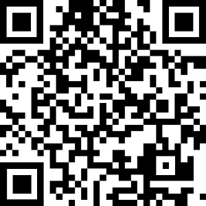
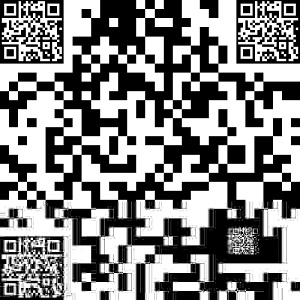
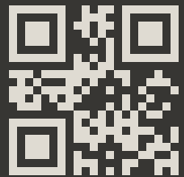

# 08 - Modern Art

*Do you like modern art?*


---

The smaller QR codes read `remove me` so I started with that:



However, that didn't help at all. The message is now: `Isn't that a bit too easy?`

Time to get hands dirty!

```
$ strings -n 10 modernart.jpg 
...
(E7EF085CEBFCE8ED93410ACF169B226A)
(KEY=1857304593749584)
```

These  two strings look really suspicious.. Let's remember them.

There's one more weird thing. The file contains
[JPEG End Of Image](https://en.wikipedia.org/wiki/JPEG#Syntax_and_structure) (`FF D9`) 2 times!
There should be only one. On top of that, the second EOI is not on the very end of the file so
there is definitely more than a single image in this file.
 
This is what I found:

- The second image which looks pretty much the same except there are some artifacts.
To get this image, you must delete the first image data (i.e. between offsets `0xB8` and `0x11352`).

  
 
  If you compare the binaries of the first and the second image, you find out that they
are exactly the same except the second image contains two extra strings:

  ```
  (E7EF085CEBFCE8ED93410ACF169B226A)
  (KEY=1857304593749584)
  ```
 
  Cool, no we know these two strings are not supposed to be here.
 
- But there is one more file, right after the second EOI. Let's cut it out.
 
  ```
  $ dd if=modernart.jpg of=out.data bs=1 skip=140836
  $ cat out.data
  ```
 
  
 
  Nice, a QR code with a message `AES-128`
 
Now it's obvious, take the string `E7EF085CEBFCE8ED93410ACF169B226A` and decrypt it using
 `AES-128` and the key `1857304593749584`.
 
The secret password is `Ju5t_An_1mag3`