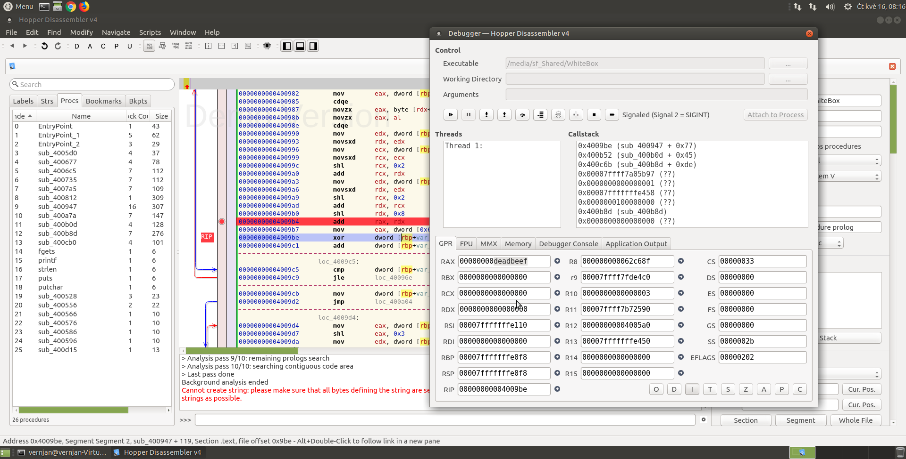

# 14 - White Box
*Do you know the mighty **WhiteBox** encryption tool? Decrypt the following cipher text!*

```
9771a6a9aea773a93edc1b9e82b745030b770f8f992d0e45d7404f1d6533f9df348dbccd71034aff88afd188007df4a5c844969584b5ffd6ed2eb92aa419914e
```

[WhiteBox](WhiteBox)

---

The first step is obvious, let's run it.
```
$ ./WhiteBox
WhiteBox Test
Enter Message to encrypt: hello world!
c0d59c645ae4b0b91e6c64f1d2358a3d
```

Nothing surprising, we got an *encryptor* and we will have to reverse it somehow. The output is 16 bytes so
we are most likely dealing with a block cipher.

Doesn't hurt to learn a bit about [White-box cryptography](http://www.whiteboxcrypto.com/). Basically, we can't
expect to find the decryption key easily but rather we must get ready for reversing an algorithm.


## Step 1 - Understand the encryption
Let's get started and fire up the favorite combo of [Hopper Disassembler](https://www.hopperapp.com/download.html)
and [Ghidra](https://ghidra-sre.org/).

Partially annotated and rewritten source code is available in [wb-ghidra.c](wb-ghidra.c) and
[wb-hopper.c](wb-hopper.c). It's messy. To see how the encryption works, go to the next step.


## Step 2 - Copy the encryption algorithm
To be sure I perfectly understand the encryption process, I decided to re-create it in Kotlin.
I made a silly mistake in rows shifting but with the help of Hopper **debugger** I was able to find it quickly.



### Extracting key
- Rotated key for the last round is at `0x602060 - 0x603060`, i.e 16 (block size) * 256 **bytes**
- Rotated key for basic rounds is at `0x603060 - 0x62b060`, i.e 10 (rounds) * 16 (block size) * 256 **integers**

```
dd if=WhiteBox of=key.data bs=1 skip=8288 count=167936
```

See how encryption works [WhiteBoxEncrypt0r](../../../src/main/kotlin/cz/vernjan/ctf/he19/ch14/WhiteBoxEncrypt0r.kt).

## Step 3 - Create the decryption algorithm
Reverting the encryption is quite straight forward with the exception of undoing the XOR operations.
Luckily, the key space is small (256^4) and XOR is damn fast on modern CPUs. I took the approach of brute
forcing the original quartet of integers. It took just a few seconds!

See how decryption works [WhiteBoxDecrypt0r](../../../src/main/kotlin/cz/vernjan/ctf/he19/ch14/WhiteBoxDecrypt0r.kt).
   
And the decrypted message is:
```
Congrats! Enter whiteboxblackhat into the Egg-o-Matic!
```   
 